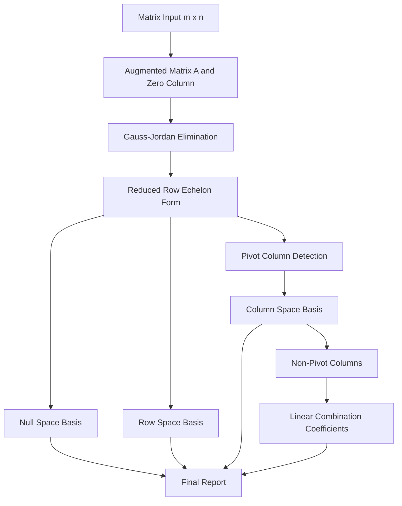

<div align="center">

</div>

---

# Fundamental Subspaces Analyzer via Gauss-Jordan Elimination

An interactive Python implementation that reduces an arbitrary matrix to reduced row echelon form and uses it to derive the null space, row space, and column space bases, while expressing every non-pivot column as an explicit linear combination of the basis columns.

<div align="left">

[](https://www.python.org/)
[](https://numpy.org/)
[](https://www.sympy.org/)
[](#)
[](#)
[](#)
[](https://opensource.org/licenses/MIT)

</div>

## Abstract

The fundamental subspaces of a matrix describe the structure of the linear system it represents and form the mathematical basis of many data mining techniques, including dimensionality reduction, feature redundancy analysis, and rank estimation. This project implements a complete, step-by-step pipeline that accepts an m x n matrix from the console, transforms the augmented matrix [A|0] into reduced row echelon form through Gauss-Jordan elimination, and extracts bases for the null space, row space, and column space. In addition, every non-pivot column of the matrix is written as a linear combination of the pivot-column basis, making the dependency structure of the columns fully explicit.

## Table of Contents

1. [Overview](#overview)
2. [Key Features](#key-features)
3. [Algorithm Pipeline](#algorithm-pipeline)
   - [Mathematical Background](#mathematical-background)
4. [Input Format](#input-format)
5. [Example Output](#example-output)
6. [Tools and Technologies](#tools-and-technologies)
7. [Repository Structure](#repository-structure)
8. [Installation and Usage](#installation-and-usage)
   - [Clone Repository](#clone-repository)
   - [Run the Analyzer](#run-the-analyzer)
9. [License](#license)
10. [Author](#author)
11. [Support](#support)

---

# Overview

**Fundamental Subspaces Analyzer** is a compact computational linear algebra tool that automates the analysis of a matrix's structure. Given a matrix `A` of size `m x n`, the program performs the entire analysis from raw input to interpretable results without relying on built-in rank or decomposition routines for the core elimination step.

Core capabilities include:

* Console-based matrix input with a built-in test case
* Gauss-Jordan elimination with row swapping and pivot normalization
* Reduced row echelon form of the augmented matrix [A|0]
* Basis extraction for the null space
* Basis extraction for the row space
* Basis extraction for the column space using pivot columns
* Expression of non-pivot columns as linear combinations of the column space basis

---

# Key Features

* Custom Gauss-Jordan elimination implemented directly on top of NumPy
* Support for matrices of arbitrary dimensions `m x n`
* Automatic pivot detection with row interchange
* Null space basis computed symbolically with SymPy
* Row space basis derived from the non-zero rows of the reduced form
* Column space basis selected from the original matrix columns at pivot positions
* Least-squares based recovery of linear combination coefficients
* Interactive mode and ready-to-run test case mode

---

# Algorithm Pipeline

The program follows a sequential pipeline in which the reduced row echelon form acts as the single source of truth for every subsequent subspace computation.



### Processing Stages

| Stage | Description |
|:-------|:-------------|
| Input Handling | Reads `m`, `n`, and the matrix entries from the console, or loads the built-in test case |
| Gauss-Jordan Elimination | Locates pivots, swaps rows, normalizes pivot rows, and eliminates entries above and below each pivot |
| Null Space | Solves `Ax = 0` from the reduced form and returns a basis of free-variable solutions |
| Row Space | Collects the non-zero rows of the reduced matrix as basis vectors |
| Column Space | Selects the columns of the original matrix that correspond to pivot positions |
| Linear Combinations | Solves a least-squares system to express each remaining column through the basis columns |

## Mathematical Background

For a matrix `A` of size `m x n`, the three fundamental subspaces are defined as follows:

| Subspace | Definition |
|:----------|:------------|
| Null Space | `N(A) = { x : Ax = 0 }` |
| Row Space | The span of all linear combinations of the rows of `A` |
| Column Space | The span of all linear combinations of the columns of `A` |

The pivot columns of the reduced row echelon form identify which original columns of `A` are linearly independent, so the corresponding columns of `A` (not of the reduced matrix) form a basis for the column space. The remaining columns depend linearly on this basis, and their coefficients are exactly what the final stage of the pipeline reports.

---

# Input Format

When the program starts, it asks whether the built-in test case should be used.

```text
Using Testcase? (y/n)
```

If `n` is selected, the matrix is read in the following format:

1. The first line contains two integers `m` and `n`, separated by a space.
2. The next `m` lines each contain `n` space-separated numbers.

```text
3 5
-3 6 -1 1 -7
1 -2 2 3 -1
2 -4 5 8 -4
```

The built-in test case uses exactly this matrix.

---

# Example Output

For the built-in test case

```text
A = [ -3   6  -1   1  -7 ]
    [  1  -2   2   3  -1 ]
    [  2  -4   5   8  -4 ]
```

the analyzer reports the following results.

**Reduced row echelon form of the augmented matrix [A|0]**

```text
[[ 1. -2.  0. -1.  3.  0.]
 [ 0.  0.  1.  2. -2.  0.]
 [ 0.  0.  0.  0.  0.  0.]]
```

**Basis of the null space**

```text
[ 2, 1,  0, 0, 0 ]
[ 1, 0, -2, 1, 0 ]
[-3, 0,  2, 0, 1 ]
```

**Basis of the row space**

```text
[ 1, -2, 0, -1,  3 ]
[ 0,  0, 1,  2, -2 ]
```

**Basis of the column space**

```text
[-3, 1, 2]
[-1, 2, 5]
```

**Non-pivot columns as linear combinations of the basis**

```text
[ 6, -2, -4] = -2 * [-3, 1, 2] +  0 * [-1, 2, 5]
[ 1,  3,  8] = -1 * [-3, 1, 2] +  2 * [-1, 2, 5]
[-7, -1, -4] =  3 * [-3, 1, 2] + -2 * [-1, 2, 5]
```

The rank of the matrix is 2, which matches the number of non-zero rows in the reduced form and the number of pivot columns.

---

# Tools and Technologies

| Component | Purpose |
|:-----------|:---------|
| Python | Core implementation language |
| NumPy | Matrix storage, row operations, and least-squares solving |
| SymPy | Exact symbolic computation of the null space basis |

---

# Repository Structure

```text
Fundamental_Subspaces_Gauss_Jordan
│
├── fundamental_subspaces_analyzer.py
│
└── README.md
```

---

# Installation and Usage

## Clone Repository

```bash
git clone https://github.com/ParmidaGh/Computational_Data_Mining.git

cd Computational_Data_Mining/Fundamental_Subspaces_Gauss_Jordan
```

## Run the Analyzer

```bash
python fundamental_subspaces_analyzer.py
```

Choose `y` to run the built-in test case, or `n` to enter a custom matrix.

---

# License

This project is licensed under the MIT License.

---

## Author

**Parmida Ghamari**
M.Sc. Student, University of Tehran
Research Assistant @ Social Networks Lab

**Research Interests:** Computational Linear Algebra, Matrix Computations, Dimensionality Reduction, Data Mining, Natural Language Processing

📧 [Parmida.ghamari@gmail.com](mailto:Parmida.ghamari@gmail.com) | 💻 [github.com/ParmidaGh](https://github.com/ParmidaGh) | 💼 [linkedin.com/in/parmida-ghamari](https://www.linkedin.com/in/parmida-ghamari)

---

## Support

If you find this project useful, consider giving it a star ⭐️

---

<p align="center">
Built with Python, NumPy, and SymPy
</p>
