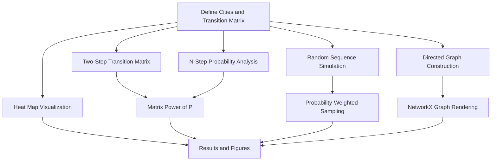

<div align="center">

</div>

---

# Markov Chain Modeling of Inter-City Transitions with Simulation and Graph Visualization

A Python implementation that models movement between cities as a discrete-time Markov chain, covering transition matrix visualization, multi-step probability analysis, stochastic path simulation, and directed graph rendering.

<div align="left">

[](https://www.python.org/)
[](https://numpy.org/)
[](https://networkx.org/)
[](https://matplotlib.org/)
[](#)
[](#)
[](#)
[](https://opensource.org/licenses/MIT)

</div>

## Abstract

Markov chains provide a compact framework for modeling systems whose future state depends only on the present state, and they underpin methods such as PageRank, sequence modeling, and probabilistic web navigation analysis. This project models travel between four cities as a Markov chain defined by a row-stochastic transition matrix. It visualizes the matrix as a heat map, computes multi-step transition probabilities through matrix exponentiation, simulates random city sequences by sampling from the transition distributions, and renders the chain as a directed graph with NetworkX.

## Table of Contents

1. [Overview](#overview)
2. [Key Features](#key-features)
3. [Model Definition](#model-definition)
   - [Transition Matrix](#transition-matrix)
   - [Mathematical Background](#mathematical-background)
4. [Analysis Pipeline](#analysis-pipeline)
5. [Example Output](#example-output)
6. [Tools and Technologies](#tools-and-technologies)
7. [Repository Structure](#repository-structure)
8. [Installation and Usage](#installation-and-usage)
   - [Clone Repository](#clone-repository)
   - [Run the Analysis](#run-the-analysis)
9. [License](#license)
10. [Author](#author)
11. [Support](#support)

---

# Overview

**Markov Chain Analysis** is a compact stochastic modeling project in which the states are four cities (Tehran, Esfahan, Mashhad, and Shiraz) and each row of the transition matrix gives the probability of moving from one city to every other city in a single step. Starting from this definition, the program performs a complete workflow from visualization to simulation.

Core capabilities include:

* Transition matrix definition and display
* Heat map visualization of transition probabilities
* Two-step transition matrix computation
* Random path generation of a given length from a chosen starting city
* N-step probability computation from a chosen starting city
* Directed graph visualization of the Markov chain

---

# Key Features

* Row-stochastic transition matrix represented with NumPy
* Multi-step transition probabilities computed through matrix powers
* Stochastic sequence simulation using probability-weighted sampling
* Reusable helper functions for sequence generation and n-step analysis
* Heat map of the transition matrix with labeled source and destination axes
* Directed graph construction with NetworkX, where edges exist only for non-zero transitions

---

# Model Definition

## Transition Matrix

The chain is defined over four states. Each row sums to 1 and describes the distribution over next cities given the current city.

| From \ To | Tehran | Esfahan | Mashhad | Shiraz |
|:-----------|:--------|:---------|:---------|:--------|
| Tehran | 0.25 | 0.25 | 0.25 | 0.25 |
| Esfahan | 0 | 0.25 | 0.25 | 0.50 |
| Mashhad | 0.75 | 0 | 0.25 | 0 |
| Shiraz | 1 | 0 | 0 | 0 |

## Mathematical Background

For a transition matrix `P`, the entry `P[i][j]` is the probability of moving from state `i` to state `j` in one step. By the Chapman-Kolmogorov equations, the probability of moving from `i` to `j` in exactly `n` steps is the `(i, j)` entry of the matrix power `P^n`. The distribution of the chain after `n` steps from a starting state is therefore the corresponding row of `P^n`.

---

# Analysis Pipeline



| Step | Description |
|:------|:-------------|
| Matrix Display | Prints the transition matrix and plots it as a heat map |
| Two-Step Matrix | Computes `P^2` with matrix exponentiation |
| Sequence Simulation | Generates a 25-city path starting from Tehran by sampling each next city from the current row of `P` |
| N-Step Probabilities | Reports the probability of being in each other city after n steps from Tehran |
| Graph Visualization | Draws the chain as a directed graph with nodes for cities and edges for non-zero transitions |

---

# Example Output

**Transition matrix after 2 steps**

```text
[[0.5    0.125  0.1875 0.1875]
 [0.6875 0.0625 0.125  0.125 ]
 [0.375  0.1875 0.25   0.1875]
 [0.25   0.25   0.25   0.25  ]]
```

**Probability of being in other cities after 2 steps starting from Tehran**

```text
{'Esfahan': 0.125, 'Mashhad': 0.1875, 'Shiraz': 0.1875}
```

**Simulated city sequence of length 25 starting from Tehran**

The sequence is sampled randomly, so it differs between runs while always respecting the transition probabilities. For example, Shiraz is always followed by Tehran, since its only non-zero transition leads there.

---

# Tools and Technologies

| Component | Purpose |
|:-----------|:---------|
| Python | Core implementation language |
| NumPy | Transition matrix storage, matrix powers, and probabilistic sampling |
| NetworkX | Directed graph construction and layout |
| Matplotlib | Heat map and graph rendering |

---

# Repository Structure

```text
Markov_Chain
│
├── markov_chain_city_transitions.py
│
└── README.md
```

---

# Installation and Usage

## Clone Repository

```bash
git clone https://github.com/ParmidaGh/Computational_Data_Mining.git

cd Computational_Data_Mining/Markov_Chain
```

## Run the Analysis

```bash
python markov_chain_city_transitions.py
```

The script prints the matrices and probabilities to the console and opens two figures: the transition matrix heat map and the Markov chain graph. Close the first figure window to proceed to the next.

---

# License

This project is licensed under the MIT License.

---

## Author

**Parmida Ghamari**
M.Sc. Student, University of Tehran
Research Assistant @ Social Networks Lab

**Research Interests:** Stochastic Processes, Markov Models, Graph Mining, Network Analysis, Data Mining, Natural Language Processing

📧 [Parmida.ghamari@gmail.com](mailto:Parmida.ghamari@gmail.com) | 💻 [github.com/ParmidaGh](https://github.com/ParmidaGh) | 💼 [linkedin.com/in/parmida-ghamari](https://www.linkedin.com/in/parmida-ghamari)

---

## Support

If you find this project useful, consider giving it a star ⭐️

---

<p align="center">
Built with Python, NumPy, NetworkX, and Matplotlib
</p>
