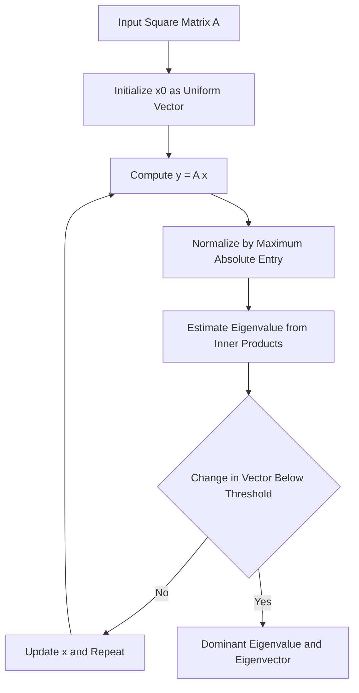
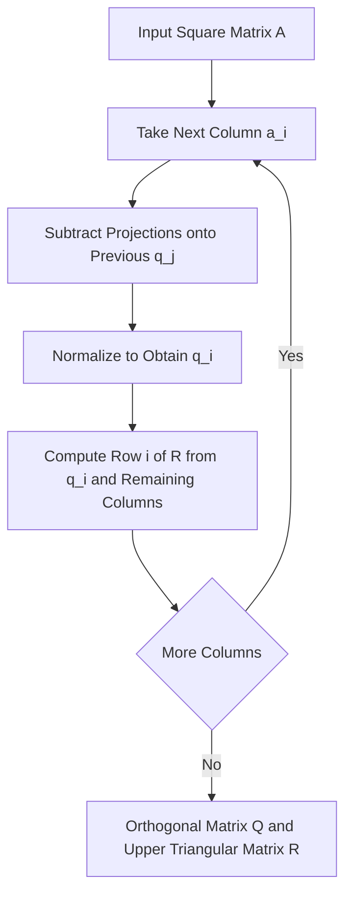

<div align="center">

</div>

---

# Power Method and Gram-Schmidt QR Decomposition from Scratch

A pair of iterative and orthogonalization-based numerical linear algebra algorithms implemented from first principles: the Power Method for approximating the dominant eigenvalue and eigenvector of a matrix, and the Gram-Schmidt process for computing its QR decomposition.

<div align="left">

[](https://www.python.org/)
[](https://numpy.org/)
[](https://jupyter.org/)
[](#)
[](#)
[](#)
[](#)
[](https://opensource.org/licenses/MIT)

</div>

## Abstract

Eigenvalue computation and matrix factorization are central building blocks of data mining methods such as PageRank, Principal Component Analysis, spectral clustering, and least-squares modeling. This project implements two classical numerical algorithms without relying on library routines for eigendecomposition or QR factorization. The Power Method iteratively estimates the dominant eigenpair of a square matrix using max-norm normalization and a Rayleigh-quotient style eigenvalue estimate, while the Gram-Schmidt procedure constructs an orthonormal basis from the matrix columns and produces the factors Q and R of its QR decomposition. Both algorithms are packaged as object-oriented implementations with interactive console input and built-in test cases.

## Table of Contents

1. [Overview](#overview)
2. [Key Features](#key-features)
3. [Power Method](#power-method)
   - [Algorithm Workflow](#algorithm-workflow)
   - [Example Output](#example-output)
4. [Gram-Schmidt QR Decomposition](#gram-schmidt-qr-decomposition)
   - [Algorithm Workflow](#algorithm-workflow-1)
   - [Example Output](#example-output-1)
5. [Tools and Technologies](#tools-and-technologies)
6. [Repository Structure](#repository-structure)
7. [Installation and Usage](#installation-and-usage)
   - [Clone Repository](#clone-repository)
   - [Run the Notebook](#run-the-notebook)
8. [License](#license)
9. [Author](#author)
10. [Support](#support)

---

# Overview

This project contains two self-contained numerical linear algebra implementations in a single notebook. Each algorithm is wrapped in a dedicated class and can be executed either with a built-in test matrix or with a matrix entered interactively from the console.

Core capabilities include:

* Dominant eigenvalue estimation for square matrices
* Dominant eigenvector approximation with max-norm scaling
* Configurable iteration limit and convergence threshold
* Orthonormal basis construction through the Gram-Schmidt process
* QR decomposition producing an orthogonal matrix Q and an upper triangular matrix R
* Console-based matrix input with built-in test cases

---

# Key Features

* Power Method implemented as a reusable `PowerMethod` class
* Convergence controlled by an iteration cap and a tolerance on successive eigenvector estimates
* Eigenvalue estimation through the ratio of inner products at every iteration
* Gram-Schmidt orthogonalization implemented as a reusable `GramSchmidt` class
* Upper triangular factor R assembled directly from projections onto the orthonormal basis
* High-precision formatted output for the Q and R matrices
* Interactive mode and ready-to-run test case mode for both algorithms

---

# Power Method

The Power Method approximates the eigenvalue of largest magnitude and its associated eigenvector by repeatedly applying the matrix to a vector and renormalizing the result. Starting from a uniform initial vector, the estimate aligns with the dominant eigenvector as iterations proceed.

## Algorithm Workflow



| Parameter | Default | Role |
|:-----------|:---------|:------|
| Maximum iterations | 100 | Upper bound on the number of iterations |
| Convergence threshold | 1e-6 | Tolerance on the norm of the change between consecutive vectors |
| Initial vector | Uniform vector of size n | Starting point of the iteration |

## Example Output

For the built-in test matrix

```text
A = [  8  -6   2 ]
    [ -6   7  -4 ]
    [  2  -4   3 ]
```

the algorithm converges to the following result.

```text
Dominant Eigenvector: [ 1.         -0.99999985  0.49999985]

Dominant Eigenvalue: 14.99999999999685 =====> ≈ 15
```

The estimated dominant eigenvalue is 15 with an eigenvector proportional to `[1, -1, 0.5]`.

---

# Gram-Schmidt QR Decomposition

The Gram-Schmidt process converts the linearly independent columns of a matrix into an orthonormal set by subtracting, from each column, its projections onto all previously computed orthonormal vectors and normalizing the remainder. The orthonormal vectors form the columns of Q, while the projection coefficients form the upper triangular matrix R, so that A = QR.

## Algorithm Workflow



| Output | Description |
|:--------|:-------------|
| Q | Matrix whose columns form an orthonormal basis of the column space of A |
| R | Upper triangular matrix of projection coefficients |

## Example Output

For the built-in test matrix

```text
A = [ 1   3   5 ]
    [ 1   3   1 ]
    [ 2  -1   7 ]
```

the decomposition yields the following factors.

```text
Matrix Q:
[[0.4082482905  0.5773502692  0.7071067812]
 [0.4082482905  0.5773502692 -0.7071067812]
 [0.8164965809 -0.5773502692 -0.0000000000]]

Matrix R:
[[2.4494897428  1.6329931619  8.1649658093]
 [0.0000000000  4.0414518843 -0.5773502692]
 [0.0000000000  0.0000000000  2.8284271247]]
```

---

# Tools and Technologies

| Component | Purpose |
|:-----------|:---------|
| Python | Core implementation language |
| NumPy | Vector and matrix operations, norms, and inner products |
| Jupyter Notebook | Interactive execution environment |

---

# Repository Structure

```text
Power_Method_and_QR_Decomposition
│
├── power_method_and_gram_schmidt_qr.ipynb
│
└── README.md
```

---

# Installation and Usage

## Clone Repository

```bash
git clone https://github.com/ParmidaGh/Computational_Data_Mining.git

cd Computational_Data_Mining/Power_Method_and_QR_Decomposition
```

## Run the Notebook

```bash
jupyter notebook power_method_and_gram_schmidt_qr.ipynb
```

Run each cell and choose `y` to use the built-in test case, or `n` to enter a custom square matrix.

---

# License

This project is licensed under the MIT License.

---

## Author

**Parmida Ghamari**
M.Sc. Student, University of Tehran
Research Assistant @ Social Networks Lab

**Research Interests:** Numerical Linear Algebra, Matrix Factorization, Eigenvalue Methods, Spectral Methods, Data Mining, Natural Language Processing

📧 [Parmida.ghamari@gmail.com](mailto:Parmida.ghamari@gmail.com) | 💻 [github.com/ParmidaGh](https://github.com/ParmidaGh) | 💼 [linkedin.com/in/parmida-ghamari](https://www.linkedin.com/in/parmida-ghamari)

---

## Support

If you find this project useful, consider giving it a star ⭐️

---

<p align="center">
Built using Python, NumPy, and Jupyter
</p>
