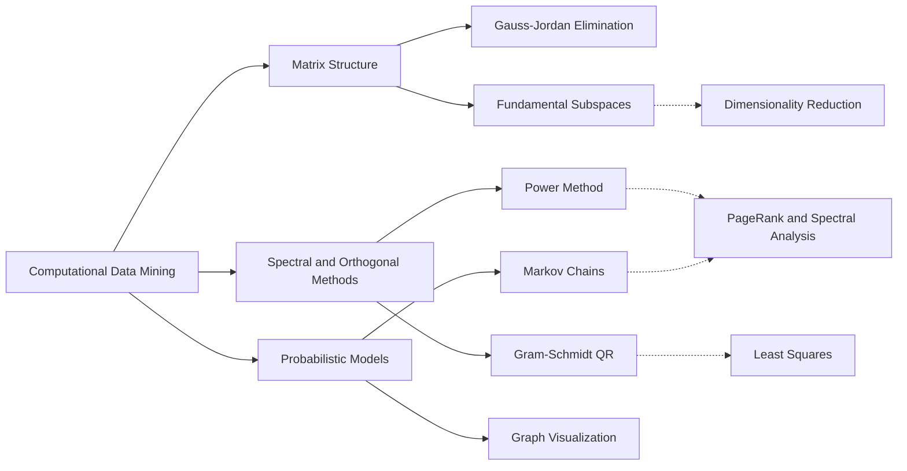

<div align="center">

</div>

---

# Computational Data Mining: Linear Algebra, Spectral Methods, and Markov Models from Scratch

A collection of hands-on implementations of the numerical and probabilistic foundations of data mining, covering matrix subspaces, eigenvalue computation, QR factorization, and Markov chain modeling, each built from first principles in Python.

<div align="left">

[](https://www.python.org/)
[](https://numpy.org/)
[](https://www.sympy.org/)
[](https://networkx.org/)
[](https://matplotlib.org/)
[](https://jupyter.org/)
[](#)
[](#)
[](https://opensource.org/licenses/MIT)

</div>

## Abstract

Most data mining techniques rest on a small set of mathematical building blocks: vector spaces, matrix factorizations, eigen-analysis, and probabilistic state models. This repository gathers the computational projects completed for the Computational Data Mining course at the University of Tehran. Each project implements a core algorithm directly rather than calling a library routine, making the underlying mechanics transparent. The collection spans Gauss-Jordan elimination with fundamental subspace extraction, the Power Method with Gram-Schmidt QR decomposition, and Markov chain simulation with graph visualization.

## Table of Contents

1. [Overview](#overview)
2. [Key Features](#key-features)
3. [Projects](#projects)
4. [Topic Map](#topic-map)
5. [Tools and Technologies](#tools-and-technologies)
6. [Repository Structure](#repository-structure)
7. [Installation and Usage](#installation-and-usage)
   - [Clone Repository](#clone-repository)
   - [Run a Project](#run-a-project)
8. [License](#license)
9. [Author](#author)
10. [Support](#support)

---

# Overview

**Computational Data Mining** is a structured portfolio of three self-contained projects. Each lives in its own folder with a dedicated README, a runnable implementation, and built-in test cases, so every algorithm can be explored independently.

The repository is designed around three ideas:

* Understand each algorithm by implementing its core steps manually
* Verify results through reproducible test cases and example outputs
* Connect classical numerical methods to their roles in modern data mining

---

# Key Features

* Gauss-Jordan elimination with null, row, and column space basis extraction
* Dominant eigenpair estimation using the Power Method
* QR decomposition through the Gram-Schmidt process
* Markov chain modeling with multi-step probabilities and path simulation
* Heat map and directed graph visualization
* Interactive console input alongside built-in test cases
* One dedicated README per project

---

# Projects

| Project | Focus | Core Methods |
|:---------|:-------|:--------------|
| [Fundamental Subspaces Analyzer](./Fundamental_Subspaces_Gauss_Jordan) | Structure of the linear system represented by a matrix | Gauss-Jordan elimination, null space, row space, column space, linear combinations of dependent columns |
| [Power Method and QR Decomposition](./Power_Method_and_QR_Decomposition) | Eigenvalue computation and orthogonal factorization | Power Method, Gram-Schmidt orthogonalization, QR decomposition |
| [Markov Chain Analysis](./Markov_Chain) | Probabilistic state transitions between cities | Transition matrices, matrix powers, stochastic simulation, graph visualization |

---

# Topic Map



These methods connect directly to practical data mining tasks: rank and subspace analysis supports feature redundancy detection and dimensionality reduction, eigenvalue methods underlie PageRank and spectral techniques, QR factorization supports least-squares solving, and Markov chains model sequential and navigational behavior.

---

# Tools and Technologies

| Component | Purpose |
|:-----------|:---------|
| Python | Core implementation language |
| NumPy | Matrix operations, norms, and sampling |
| SymPy | Exact symbolic null space computation |
| NetworkX | Directed graph construction |
| Matplotlib | Heat map and graph visualization |
| Jupyter Notebook | Interactive execution for notebook-based projects |

---

# Repository Structure

```text
Computational_Data_Mining
│
├── Fundamental_Subspaces_Gauss_Jordan/
│   ├── fundamental_subspaces_analyzer.py
│   └── README.md
│
├── Power_Method_and_QR_Decomposition/
│   ├── power_method_and_gram_schmidt_qr.ipynb
│   └── README.md
│
├── Markov_Chain/
│   ├── markov_chain_city_transitions.py
│   └── README.md
│
└── README.md
```

---

# Installation and Usage

## Clone Repository

```bash
git clone https://github.com/ParmidaGh/Computational_Data_Mining.git

cd Computational_Data_Mining
```

## Run a Project

Enter a project folder and follow the instructions in its README. For example:

```bash
cd HW1_Fundamental_Subspaces_Gauss_Jordan

python fundamental_subspaces_analyzer.py
```

---

# License

This project is licensed under the MIT License.

---

## Author

**Parmida Ghamari**
M.Sc. Student, University of Tehran
Research Assistant @ Social Networks Lab

**Research Interests:** Computational Data Mining, Numerical Linear Algebra, Matrix Factorization, Stochastic Processes, Natural Language Processing

📧 [Parmida.ghamari@gmail.com](mailto:Parmida.ghamari@gmail.com) | 💻 [github.com/ParmidaGh](https://github.com/ParmidaGh) | 💼 [linkedin.com/in/parmida-ghamari](https://www.linkedin.com/in/parmida-ghamari)

---

## Support

If you find this repository useful, consider giving it a star ⭐️

---

<p align="center">
Built with Python, NumPy, SymPy, NetworkX, and Matplotlib
</p>
